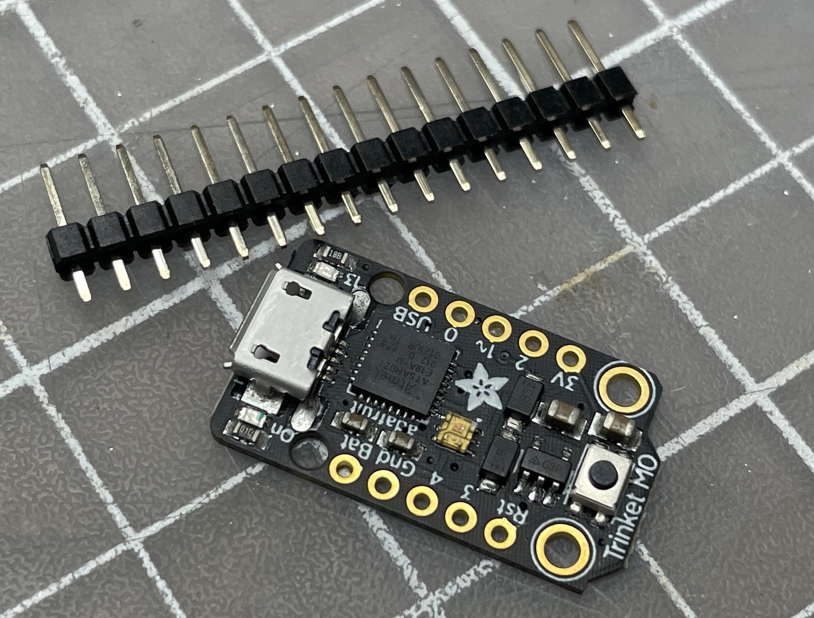
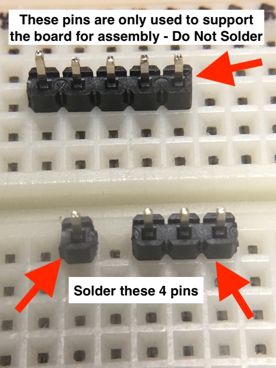
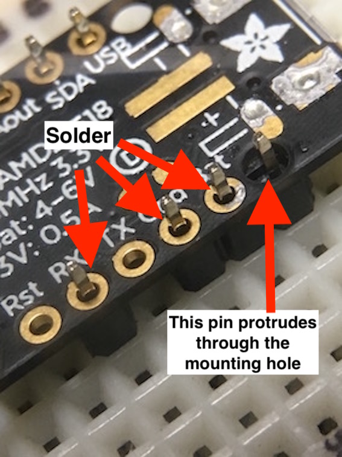
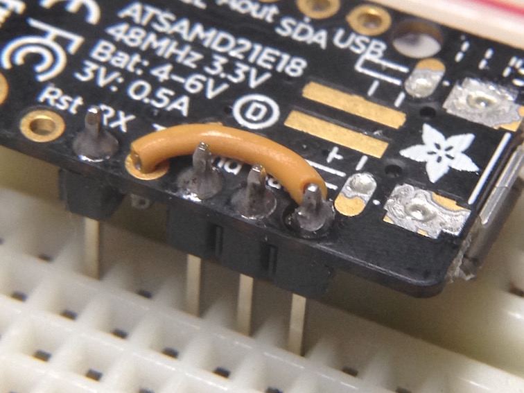
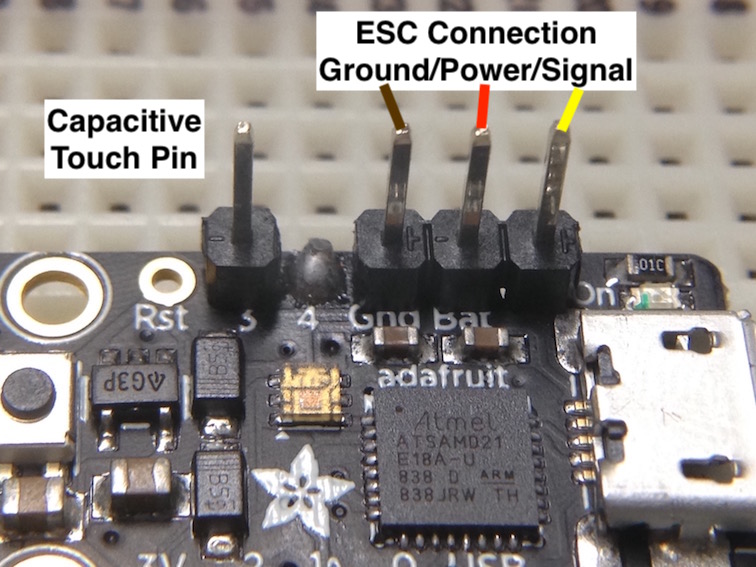



## Bill of Materials ##

The components required to build a timer can be purchased from numerous on-line sources. The following chart lists some of the more popular suppliers but Adafruit has <a href="https://www.adafruit.com/distributors" target="_blank">distributors</a> around the world and you may be able to source products closer to home:

| Qty | Description | Online Sources |
| :---: | ----------- | ------------- |
| 1 | Adafruit Trinket M0, Product ID: 3500 | [Adafruit][11] [Mouser][10] [Digikey][9]  |
| 5 cm | 24 to 28AWG Stranded Insulated Wire | [Adafruit][3] |
| 1 | 1.0K ohm Resistor (Optional) | [Adafruit][7] [Mouser][8] |

## Tools Required ##

Electronic soldering equipment; soldering iron, flux and solder.  These are available from numerous online sources as well.  If you need to brush-up on your electronics soldering skills there are some good tutorials on <a href="https://learn.adafruit.com/adafruit-guide-excellent-soldering" target="_blank">Adafruit</a> and <a href="https://learn.sparkfun.com/tutorials/how-to-solder-through-hole-soldering?_ga=2.264399628.2047829894.1668554338-987389297.1656854053" target="_blank">Sparkfun</a>.

{: .warning }
Do **not** use a strong acid based flux.  While this type of flux is great for home plumbing repairs and building fuel tanks, it can be very corrosive to fragile electronic circuitry. Be sure to only use a <a href="https://www.chipquik.com/store/product_info.php?products_id=310027" target="_blank">rosin based</a> or <a href="https://www.chipquik.com/store/product_info.php?products_id=330003" target="_blank">no-clean  type</a> flux suitable for electronics assembly.

Other tools that may come in handy; magnifying glass, wire strippers, pliers and a small breadboard (optional).  For programming the timer you will need a micro-USB *data* cable.

## Timer Assembly ##

The board as supplied includes a strip of breakaway header pins.

---
**Step 1** - Trim the header strip into a (3) pin and a (1) single pin.  Using a small breadboard helps in alignment of the pins.  A portion of unused header strip can be used to support the board for soldering.  

**Step 2** - When ready solder the pins as shown in the photo below.

___
**Step 3** - Solder a short length of jumper wire between the pin that protrudes through the mounting hole to pin 4/TX.  This is the PWM servo signal to the ESC.  The pins need to be arranged in this manner in order to mate correctly with a standard servo connector.  

**Optional** - instead of a short length of wire you can use a 1K ohm resistor to join the two pins.  This adds protection to the output pin of the Trinket M0 in case you make a mistake and install the ESC connector the wrong way.

___
**Step 4** - Because the signal pin passes through the mounting hole and is not soldered directly to the board, it is possible that the ESC connector may try and push the pin out the back of the board.  If that’s the case, a well-placed dab of epoxy on the back of the board will secure the pin.

{: .highlight}
**IMPORTANT** - When connecting the ESC be sure the connector ground wire (brown or black) is attached to the ground pin on the board and the signal wire (yellow or white) is connected to the pin that passes through the mounting hole.  The red power wire should always be in the middle.

___
**Step 5** - Optional: It's a good practice to remove any residual solder flux from the joints. You can do this by using an old toothbrush dipped in 99% Isopropyl alcohol, gently scrubbing away the remaining flux. This high-concentration alcohol should be readily available at your local drug store.

## Installation ##

A piece of Velcro can be used to attach the timer to the side of the fuselage facing the pilot.  The super bright DotStar LED is visible from the inside of the circle, even on a sunny day.  The DotStar LED is used to communicate the different modes of operation.

[3]: https://www.adafruit.com/category/472
[7]: https://www.adafruit.com/product/4294
[8]: https://www.mouser.com/ProductDetail/SEI-Stackpole/CF18JT1K00?qs=sGAEpiMZZMsPqMdJzcrNwuaNijEq1Pkyg2rv5L6UyoTAJ5IK6%2FI23A%3D%3D
[9]: https://www.digikey.com/en/products/detail/adafruit-industries-llc/3500/7623049?s=N4IgTCBcDaIIYBM4DMBOBXAlgFwAQGYBWABmJAF0BfIA
[10]: https://www.mouser.com/ProductDetail/Adafruit/3500?qs=YCa%2FAAYMW02nmtTxRamnHA%3D%3D
[11]: https://www.adafruit.com/product/3500
