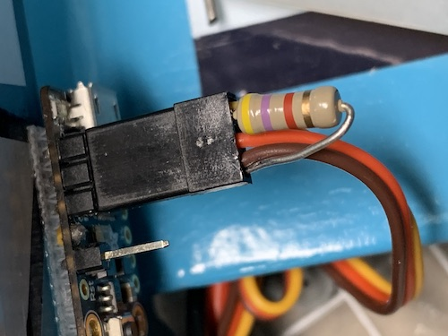



## Frequently Asked Questions ##

**Does the Touch_and_Go work with any ESC?**  If the ESC works well with a servo tester there's no reason why it shouldn't work with the timer.  The timer does require an ESC with a built in BEC (battery eliminator circuit).  Ideally, the ESC should have a means to calibrate the throttle to match the timer output range.  It will not work with ESCs that require a mandatory maximum throttle signal in order to complete the throttle calibration sequence prior to each and every flight.

**Can I extend the touch sensor pin?**  Yes, you can.  You will have to experiment to make sure it works reliably, but you can add a wire to the touch sensor pin to extend the "sensor" to another location. Tape similar to this <a href="https://www.adafruit.com/product/3961" target="_blank">nylon conductive tape</a> works really well.

**Why don't I get the short throttle 'blip' when I start the timer?**  Follow your ESC instructions to perform a [Throttle Calibration](Power%20System%20Information.html#throttle-calibration).  Also make sure any soft start feature in the ESC is set to fast or hard start.

**How can I get the ESC to complete the arming sequence?**  Some ESCs will immediately check for a valid low throttle signal before they will arm.  The boot process of the Adafruit Trinket is about 1.5 seconds. During this time the voltage on the output pin of the Trinket is “floating”.  This may cause the ESC to think there is an invalid signal and prevent it from arming. There are two possible fixes for this issue. 1) After connecting the battery and the ESC does not arm, press the reset button (the tiny black pushbutton) on the Trinket.  This will restart the Trinket boot sequence and sometimes the ESC will arm on the second try.  2) Add a 4.7K ohm resistor between the ground wire and the signal wire of the ESC connector.  This will “pull down” the voltage on the output pin while the Trinket boots up.  With the resistor installed, after connecting the battery, the ESC should patiently wait until a valid signal is present and then arm normally.

**Why doesn’t the RPM decrease when I double tap?**  It is possible to set the throttle output of the timer greater than the maximum RPM capable of your motor/prop combination.  Keep double tapping and eventually the motor will start to slow down.

**Can I turn off the voltage compensation?**  Yes, by changing the setting in the program code.  See the FAQ about changes to the program code above.  In the Flight Mode portion of the code you will see the comment to boost the RPM a tiny bit, change the amount of compensation from .005 to .000.

**Can I make a housing for the timer to help protect it?**  Of course, but making it completely weatherproof may be a challenge.

**What is bootout.txt on the `CIRCUITPY` drive?**  This a small text file that is automatically generated by CircuitPython.  It includes information on which version of CircuitPython is installed as well as details about the microcontroller board.

**What version of the program code do I have installed?** The software version is included as a comment near the top of the program code.  It can be viewed by opening the **main.py** file using a simple text editor program like Notebook or TextEdit.

**Where can I find the previous copy of the timer instructions?** With the release of v1.4 I revised the instructions to this online format.  If you would like to refer to the previous PDF version they can be found <a href="https://drive.google.com/file/d/1P2q-cP1rcVPWtT6-C7MVoqO_Qo1-7NKQ/view?usp=sharing" target="_blank">here</a>.

**What is CircuitPython?**  CircuitPython is Adafruit's fork of the MicroPython programming language.  Micropython is a subset of instructions derived from Python specifically for use on microcontrollers.  CircuitPython is well supported and a tonne of information can be found in various <a href="https://learn.adafruit.com/welcome-to-circuitpython/circuitpython-essentials" target="_blank">Adafruit learning guides</a>.

**Can I make changes to the program code?**  Yes, Adafruit and CircuitPython make it easy.  If you are making minor changes, open main.py in any text editor program, like Notebook or TextEdit.  Make your changes and then save it as main.py back onto the `CIRCUITPY` drive.  As soon as the code is saved the program re-boots and your new code starts running.  If you would like to make more substantial changes then I would suggest a free code editing program like <a href="https://codewith.mu/en/about" target="_blank">Mu Editor</a>.  The <a href="https://learn.adafruit.com/welcome-to-circuitpython/creating-and-editing-code" target="_blank">Adafruit Learning Guides</a> cover everything you need to know.
