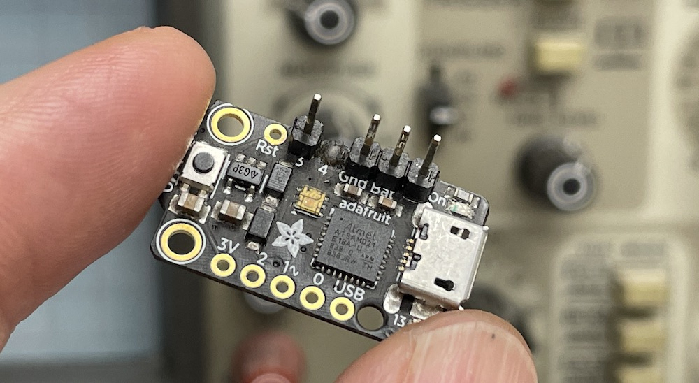



# A DIY Control Line Timer Project
{: .text-center }

### **NEW!!** Version: v1.4, Oct/2025
 
**Touch and Go** is an open source software program to create your own basic timer for an electric powered control line model aircraft.  Utilizing a low cost Adafruit Industries Trinket M0 microcontroller development board the timer is compact, light-weight and simple to use.   With a few taps of your finger the timer can be quickly programmed at the flying field to change the time delay before start-up, the length of the flight and the RPM setting of the motor.  Because it’s open source, you can customize the functionality to your liking or even add new features.

Although Touch and Go is meant to be an economical “do-it-yourself“ project, for **only $9** it packs a lot of useful functions not found in other basic timers:
- Compact.  27mm x 15mm
-	Lightweight.  1.5g
-	Capacitive touch sensor for user input.  No additional switches or buttons required.
-	Onboard multicolor DotStar LED.  Visible from the center of the circle, even in bright sunlight.
- The LED is used to communicate the current status of the timer; no more guessing.
-	Field programmable. The delay, flight time and RPM settings can be changed without any extra tools, cards, computers or programming boxes.
-	Soft start.  The programmed RPM increases over a period of several seconds for a smoother take-off.
- RPM boost during the flight to compensate for decreasing battery voltage.
- End of flight indication. A short decrease in RPM followed by a short increase in RPM before cutoff for improved glide and landing.
-	On-board memory to store your settings.
-	Usable with low cost ESC’s.
-	Easy to assemble.  Solder a few pins, update CircuitPython, drag and drop the program and library files onto the timer, connect to your ESC, adjust your settings and fly.
-	Well supported.  The Adafruit web pages are chock-full of information and comprehensive learning guides to answer any question.
-	Written in CircuitPython.  No programming skills or experience is required, unless you want to change some things. In that case, CircuitPython is an easy to read and easy to learn language.
-	Built-in micro USB port.  Plug it into your computer and it shows up as a small disk drive.  The stored programs can be opened and edited in a simple text editing program.  No extra software or apps to download.  Although, if you intend to make extensive changes to the code then a free software editing program is highly recommended.
-	Reprogrammable.  Have another project in mind?  The Trinket M0 can be programmed for a multitude of other maker and hacker projects.  It can even be programmed as an Arduino board if preferred.

{: .highlight}
The Adafruit Trinket M0, Product ID: 3500, is readily available directly from <a href="https://www.adafruit.com/product/3500" target="_blank">Adafruit</a> or through their numerous <a href="https://www.adafruit.com/distributors" target="_blank">distributors around the world</a>.  Find one near you and enjoy the reliability and convenience of electric powered control line flight.

{: .new}
If you are looking for a more advanced timer to take your stunt flying to a whole new level then checkout the [Climb_and_Dive timer][1].

[1]: https://circuitflyer.com/Climb_and_Dive/
